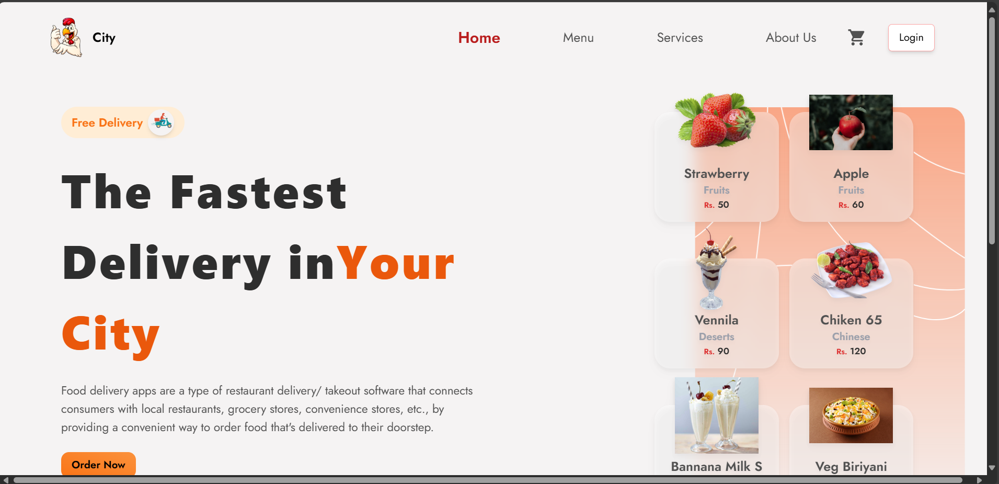
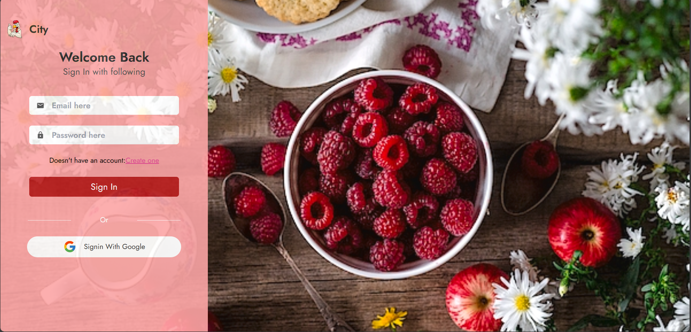
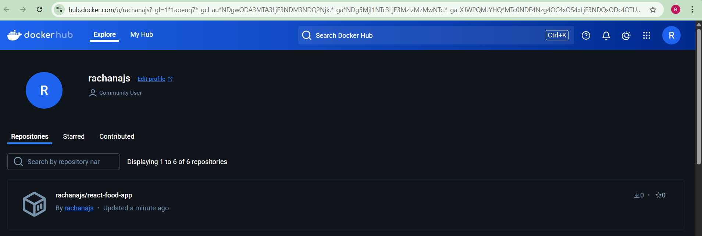
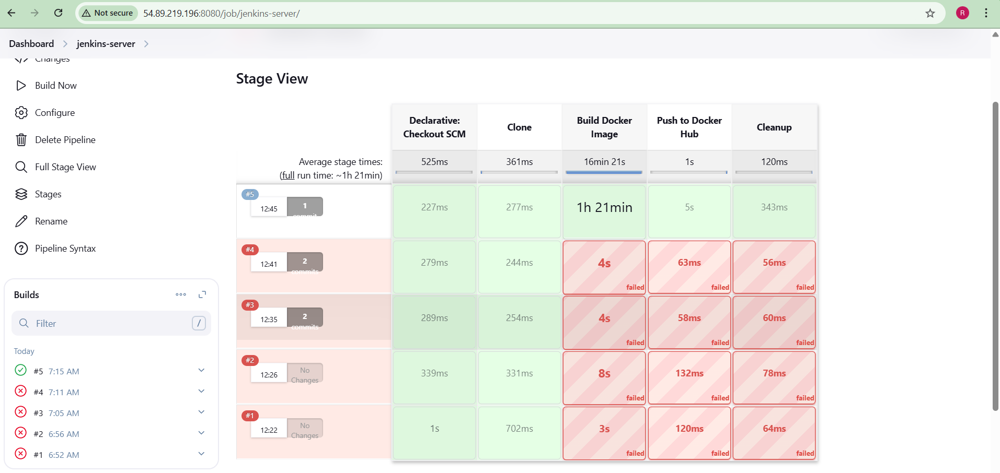

# react-food-app

A responsive React-based food ordering application that allows users to browse a food menu, manage a cart, and place orders.

## 🌐 Features
- Fully responsive UI with Material-UI and TailwindCSS
- Firebase integration for backend services
- Redux for state management
- React Router for client-side routing
- Deployed using Docker
- CI/CD with Jenkins and Docker Hub


## 🚀 Technologies Used

- **Frontend:** React, Tailwind CSS, Material UI
- **CI/CD:** Jenkins
- **Containerization:** Docker
- **State Management:** Redux
- **Routing:** React Router DOM
- **Backend:** Firebase (for authentication and database)

## ⚙️ Steps to Run Locally with Docker

1. **Build the Docker Image**
   ```bash
   docker build -t react-food-app .

2.Run the Container
docker run -d -p 3000:80 --name food-app react-food-app

3.Visit the app at: http://localhost:3000 (or your EC2 public IP)

🧪 Jenkins CI/CD Pipeline
Jenkins pulls the code from GitHub
Builds the Docker image
Pushes it to Docker Hub
Triggers container deployment on EC2

🔧 Dockerfile Sample
# Step 1: Build the React app
FROM node:18-alpine as builder
WORKDIR /app
COPY client/package*.json ./
RUN npm install --legacy-peer-deps
COPY client/ ./
RUN npm run build

# Step 2: Serve the React app using nginx
FROM nginx:alpine
COPY --from=builder /app/build /usr/share/nginx/html
EXPOSE 80
CMD ["nginx", "-g", "daemon off;"]

📦 Jenkinsfile Sample
pipeline {
    agent any

    stages {
        stage('Clone') {
            steps {
                git 'https://github.com/Rachana-js/react-food-app.git'
            }
        }
        stage('Build Docker Image') {
            steps {
                script {
                    dockerImage = docker.build("rachanajs/react-food-app")
                }
            }
        }
        stage('Push to Docker Hub') {
            steps {
                withDockerRegistry([credentialsId: 'docker-hub-credentials', url: '']) {
                    script {
                        dockerImage.push()
                    }
                }
            }
        }
        stage('Cleanup') {
            steps {
                sh 'docker rmi rachanajs/react-food-app'
            }
        }
    }
}

Reference screenshots 
## 📸 Screenshots

### 🏠 Homepage


### 🏠 Loginpage


### 🐳 Docker Container Running


### 🛠️ Jenkins Build Success


